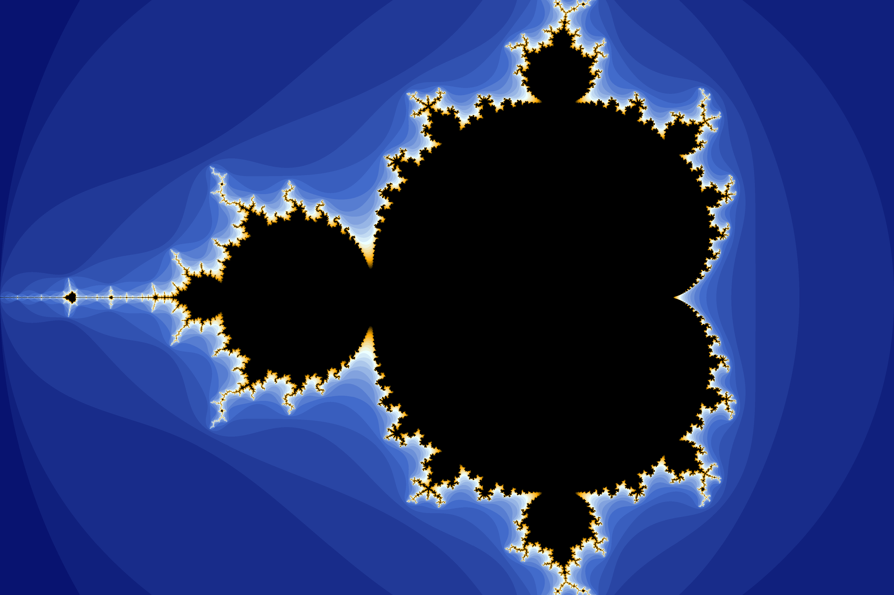
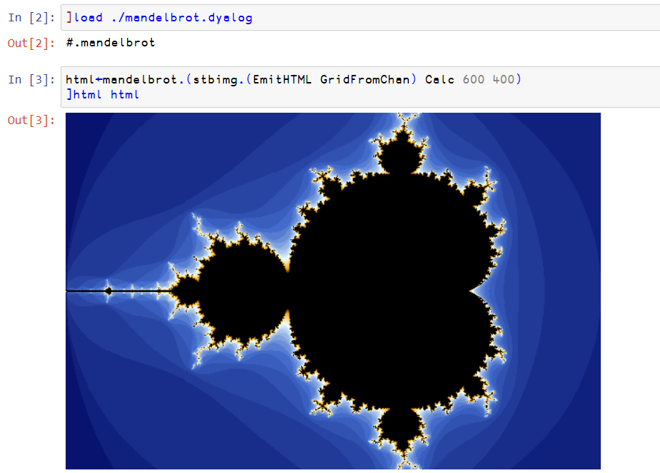

# apl-stbimg
Save, load and resize image in Dyalog APL. Based on [stb_image](https://github.com/nothings/stb).



## Build
- (Optional) Get the newest `stb_image.h`, `stb_image_resize.h` and `stb_image_write.h` files from the [stb](https://github.com/nothings/stb) repository.
- Build the shared library

  - Windows using MinGW-w64:
    ```
    gcc stbimg.c -Wall -Wextra -pedantic -O3 -march=native -static -shared -o stbimg.dll
    ```
    Put the shared library somewhere [⎕NA](https://help.dyalog.com/18.2/Content/Language/System%20Functions/na.htm) knows.
  
  - Linux:
    ```
    gcc stbimg.c -Wall -Wextra -pedantic -O3 -march=native -fPIC -shared -o stbimg.so
    ```
    Put the shared library somewhere ⎕NA knows.
    
    Or (experimental) use an APL script to compile and install the shared library under $DYALOG/lib:
    ```
    sudo dyalogscript install.apls
    ```

- (Optional) Load the class script (`stbimg.aplc`) into a `clear WS` and save it as a workspace `stbimg.dws` on the workspace search path.

## Usage
The namespace/class stbimg is in `stbimg.aplc`.

The documentation assumes ```⎕IO ⎕ML←0 1```. `stbimg` itself is ⎕IO and ⎕ML insensitive. 


### Load Image

```apl
{R}←{X} stbimg.Load Y
```
Y is the path of a file whose format is [supported by stb_image](https://github.com/nothings/stb/blob/master/stb_image.h#L19).  
X, if present, is one of 1, 2, 3 or 4. It represents the number of color channels.  
| number of channels | description         | constant                          |
| ------------------ | ------------------- | --------------------------------- |
| 1                  | grayscale           | `stbimg.Y`, `stbimg.GRAY`         |
| 2                  | grayscale and alpha | `stbimg.YA`, `stbimg.GRAY_ALPHA`  |
| 3                  | rgb                 | `stbimg.RGB`                      |
| 4                  | rgb and alpha       | `stbimg.RGBA`, `stbimg.RGB_ALPHA` |

If X is not present, the number of channels is decided by the image.  
R is a rank 3 integer (0-255) array, whose shape equals to `(height, width, channels)` of the image.

```apl
R←{X} stbimg.LoadMem Y
```
Y is a buffer (byte array) containing an image.  
Otherwise it is the same as `stbimg.Load`. 

### Save Image

```apl
X←X stbimg.Save Y
```
Y is a rank 2 array of grayscale or rank 3 array.  
| `⍴Y`  | description                                         |
| ----- | --------------------------------------------------- |
| \[0\] | the height of the image.                            |
| \[1\] | the width of the image.                             |
| \[2\] | the number of channels (1, 2, 3 or 4) if it exists. |

X is the path. Currently, the supported extensions are .png, .bmp, .jpg (or .jpeg) and .tga.

```apl
R←stbimg.EmitHTML Y
```
Y is a rank 2 array of grayscale or rank 3 array. See `stbimg.Save`.  
R is a character vector containing an HTML \ tag with a base64-encoded png embedded.

### Get Image Info

```apl
R←stbimg.Info Y
```
Y is the path of a file whose format is supported by stb_image.  
R is a vector of 4 elements.  
| R\[\] | description                                                                            |
| ----- | -------------------------------------------------------------------------------------- |
| \[0\] | 1 if the file is read successfully. If R\[0\] is 0, the rest of R is invalid.          |
| \[1\] | the height of the image.                                                               |
| \[2\] | the width of the image.                                                                |
| \[3\] | the number of channels (1, 2, 3 or 4). Refer to the previous section of `stbimg.Load`. |

```apl
R←stbimg.InfoMem Y
```
Y is a buffer (byte array) containing an image.  
R is the information. See `stbimg.Info`.

### Resize Image

```apl
R←X stbimg.Resize Y
```
Y is a rank 2 array of grayscale or rank 3 array. See `stbimg.Save`.  
X is the new (height,width) of the image. If this order seems counter-intuitive, think of `⍴` or reshape.  
R is the resized image with the new height and width, but the same channels as Y.

```apl
R←X stbimg.Scale Y
```
Y is a rank 2 array of grayscale or rank 3 array. See `stbimg.Save`.  
X is the scale. The new (height,width) is the integer part of X times (height,width) of the image.  
R is the resized image with the new height and width, but the same channels as Y.

### Display Image

```apl
{R}←{X} stbimg.Show Y
{R}←{X} stbimg.ShowForm Y
```
Y can be
- a rank 2 array of grayscale or rank 3 array. See `stbimg.Save`.
- the path of a file whose format is jpg, bmp or png. 

X is a string to be used as the left argument of `⎕WC`. X defaults to `'∆h'`.  
R is a refrence to the GUI object.  
`stbimg.Show` uses HTMLRenderer (cross-platform).  
`stbimg.ShowForm` uses `X ⎕WC 'Form'`

### Helpers

```apl
R←stbimg.Normalize Y
```
Y is an array of 0-255 integers.  
R is the corresponding  0-1 floating point number values.

```apl
R←stbimg.Denormalize Y
```
Y is an array of 0-1 floating point numbers.  
R is the corresponding 0-255 integer values.

```apl
R←stbimg.Interleave Y
```
Y is an array of shape `(height, width, channels)`.  
R is an array of shape `(channels, height, width)`.

```apl
R←stbimg.Deinterleave Y
```
Y is an array of shape `(channels, height, width)`.  
R is an array of shape `(height, width, channels)`.  

## Example
See `mandelbrot.apln` and `halftone.apln`.

For mandelbrot:
```apl
      mandelbrot.Run
```

For halftone:
```apl
      halftone.Run
```

On Windows, a dialog about network access might show up -- that can be (a) mandelbrot uses `isolate`; (b) halftone.Demo downloads an image from the internet.



## License
`stbimg.c`, `stbimg.aplc`, `halftone.apln` and `mandelbrot.apln` are under MIT license.

`stb_image.h`, `stb_image_resize.h` and `stb_image_write.h` are in the public domain. Big thanks to all contributors of the stb library.
