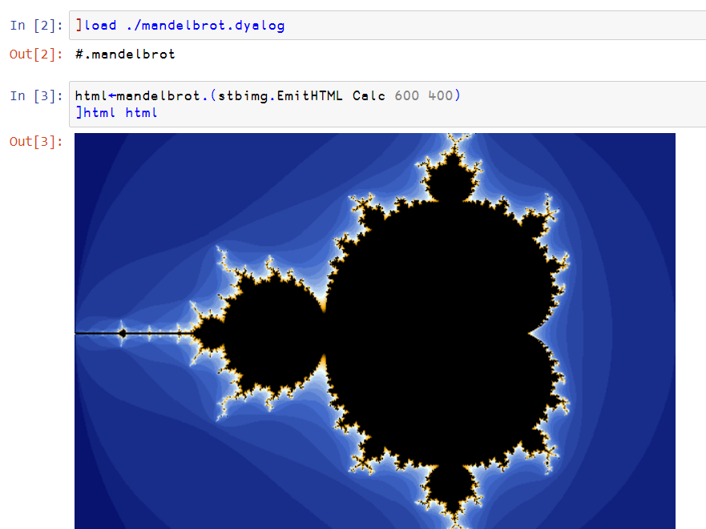

# apl-stbimg
Save and load image in Dyalog APL. Based on [stb_image](https://github.com/nothings/stb).


## Build
- (Optional) Get the newest `stb_image.h`, `stb_image_resize.h` and `stb_image_write.h` files from the [stb](https://github.com/nothings/stb) repository.
- Build the shared library

  On Window using MSYS2:
  ```
  gcc stbimg.c -Wall -Wextra -pedantic -O3 -march=native -static -shared -o stbimg.dll
  ```
  
  On Linux:
  ```
  gcc stbimg.c -Wall -Wextra -pedantic -O3 -march=native -fPIC -shared -o stbimg.so
  ```
  
- Change the field `shared_lib` in `stbimg.dyalog` to suitable name if not on Windows.  
  Put the shared library somewhere [⎕NA](https://help.dyalog.com/18.2/Content/Language/System%20Functions/na.htm) knows. Or, alternatively, edit `shared_lib` to the specific path.

- (Optional) Load the class script (`stbimg.dyalog`) into a `clear WS` and save it as a workspace `stbimg.dws` on the workspace search path. (Required to run examples)

## Usage
The namespace/class stbimg is in `stbimg.dyalog`.

The documentation assumes ```⎕IO ⎕ML←0 1```. `stbimg` is ⎕IO and ⎕ML insensitive (the class has its ⎕IO and ⎕ML). 

The "Norm" variants of functions expect color to be 0-1 floating point numbers. The "Lin" variants are their linear version.  
Otherwise, color is in 0-255 integer value.

```apl
R←{X} stbimg.Load Y
R←{X} stbimg.LoadLin Y
R←{X} stbimg.LoadNorm Y
```
Y is the path of a file whose format is [supported by stb_image](https://github.com/nothings/stb/blob/master/stb_image.h#L19).  
X, if present, is one of 1, 2, 3 or 4. It represents the number of color channels.  
| number of channels | description |
| --- | --- |
| 1 | greyscale |
| 2 | greyscale and alpha |
| 3 | rgb |
| 4 | rgb and alpha |

If X is not present, the number of channels is decided by the image.  
R is a vector of matrices representing colors. Length of R equals to the number of channels. Thus if X is present, `X≡≢R`.  
The shape of matrices in R equals to `height,width` of the image.

```apl
R←{X} stbimg.LoadMem Y
```
Y is a memory (byte array) containing an image.  
Otherwise it is the same as `stbimg.Load`. 

```apl
X←X stbimg.Save Y
```
Y is either a simple matrix for greyscale, or a vector of matrices. `≢⊆Y` is the number of channels of the resulting image.  
X is the path. Currently, the supported extensions are .png, .bmp, .jpg (or .jpeg) and .tga.

```apl
R←{X} stbimg.EmitHTML Y
```
Y is either a simple matrix for greyscale, or a vector of matrices. `≢⊆Y` is the number of channels of the resulting image.  
If X exists and is true (has value 1), the image has a min and max size.  
R is a character vector containing an HTML \ tag with a base64-encoded png embedded.

```apl
R←stbimg.Info Y
```
Y is the path of a file whose format is supported by stb_image.  
R is a length 4 vector.  
| R\[\] | description |
| --- | --- |
| R\[0\] | 1 if the file is read successfully. If R\[0\] is 0, the rest of R is invalid. |
| R\[1\] | the width of the image. |
| R\[2\] | the height of the image. |
| R\[3\] | the number of channels (one of 1, 2, 3 or 4). Refer to the previous section of `stbimg.Load`. |

```apl
R←stbimg.InfoMem Y
```
Y is a memory (byte array) containing an image.  
R is the information. See `stbimg.Info`.

```apl
stbimg.Disp Y
stbimg.DispHTML Y
```
Y is either a simple matrix for greyscale, or a vector of matrices. `≢⊆Y` is the number of channels of the resulting image. The alpha channel is ignored.  
The image is displayed on a window implemented in Dyalog GUI object "Form" or (for DispHTML) "HTMLRenderer" (cross-platform).

```apl
stbimg.Show Y
stbimg.ShowHTML Y
```
Y is the path of a file whose format is jpg, bmp or png.  
The image is displayed on a window implemented in Dyalog GUI object "Form" or (for ShowHTML) "HTMLRenderer" (cross-platform).

```apl
R←stbimg.FromLin Y
R←stbimg.FromNorm Y
```
Y is either a simple matrix for greyscale, or a vector of matrices.  
R is the corresponding 0-255 integer values.

```apl
R←stbimg.ToLin Y
R←stbimg.ToNorm Y
```
Y is either a simple matrix for greyscale, or a vector of matrices of 0-255 integers.  
R is the corresponding values.

```apl
R←stbimg.LinFromNorm Y
R←stbimg.NormFromLin Y
```
Y is either a simple matrix for greyscale, or a vector of matrices.  
R is the corresponding values.

```apl
R←X stbimg.GammaCorr Y
```
Y is either a simple matrix for greyscale, or a vector of matrices.  
X is a gamma value.  
R is the result of `Y*X`, but the alpha channel is not changed.

## Example
See `mandelbrot.dyalog` and `halftone.dyalog`.

For mandelbrot:
```apl
      mandelbrot.Demo
```

For halftone:
```apl
      ]load HttpCommand
      halftone.Demo
```

On Windows, a dialog about network access might show up -- that can be (a) mandelbrot uses `isolate`; (b) halftone.Demo downloads an image from the internet.



## License
`stbimg.c`, `stbimg.dyalog`, `halftone.dyalog` and `mandelbrot.dyalog` are under MIT license.

`stb_image.h`, `stb_image_resize.h` and `stb_image_write.h` are in the public domain.

WIP
