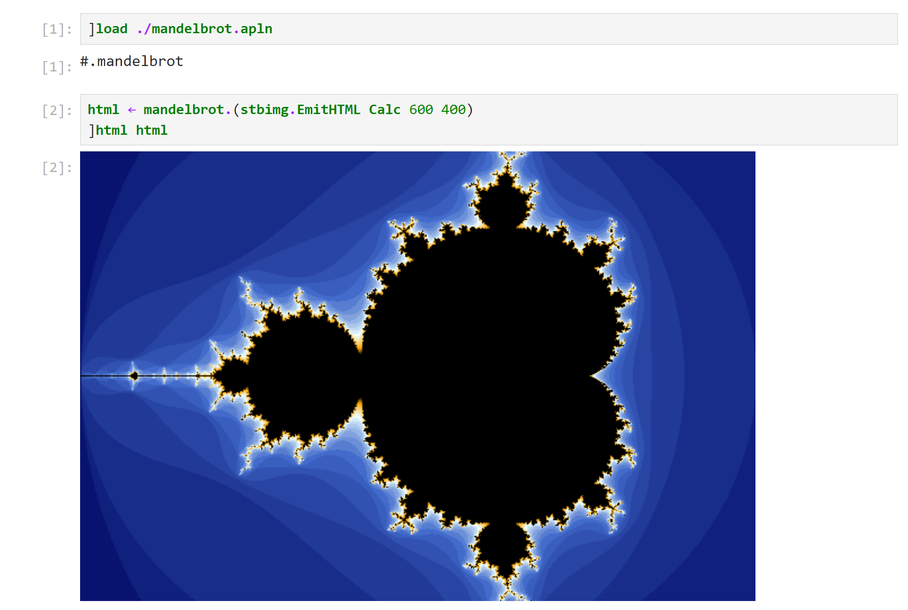

# apl-stbimg
Save, load and resize image in Dyalog APL. Based on [stb_image](https://github.com/nothings/stb).


## Build
- (Optional) Get the newest `stb_image.h`, `stb_image_resize.h` and `stb_image_write.h` files from the [stb](https://github.com/nothings/stb) repository.
- Build the shared library

  - Windows using MinGW-w64:
    ```
    gcc stbimg.c -Wall -Wextra -pedantic -O3 -march=native -static -shared -o stbimg.dll
    ```
    Put the shared library somewhere [⎕NA](https://help.dyalog.com/18.2/Content/Language/System%20Functions/na.htm) knows.
  
  - Linux:
    ```
    gcc stbimg.c -Wall -Wextra -pedantic -O3 -march=native -fPIC -shared -o stbimg.so
    ```
    Put the shared library somewhere ⎕NA knows.
    
    Or (experimental) use an APL script to compile and install the shared library under $DYALOG/lib:
    ```
    sudo dyalogscript install.apls
    ```

- (Optional) Load the class script (`stbimg.dyalog`) into a `clear WS` and save it as a workspace `stbimg.dws` on the workspace search path. (Required to run examples)

## Usage
The namespace/class stbimg is in `stbimg.dyalog`.

The documentation assumes ```⎕IO ⎕ML←0 1```. `stbimg` is ⎕IO and ⎕ML insensitive (the class has its ⎕IO and ⎕ML). 

The "Norm" variants of functions expect color to be 0-1 floating point numbers.
Otherwise, color is in 0-255 integer value.

### Load Image

```apl
R←{X} stbimg.Load Y
R←{X} stbimg.LoadNorm Y
```
Y is the path of a file whose format is [supported by stb_image](https://github.com/nothings/stb/blob/master/stb_image.h#L19).  
X, if present, is one of 1, 2, 3 or 4. It represents the number of color channels.  
| number of channels | description |
| --- | --- |
| 1 | greyscale |
| 2 | greyscale and alpha |
| 3 | rgb |
| 4 | rgb and alpha |

If X is not present, the number of channels is decided by the image.  
R is a rank 3 array whose shape equals to `(height, width, channels)` of the image.

```apl
R←{X} stbimg.LoadMem Y
```
Y is a buffer (byte array) containing an image.  
Otherwise it is the same as `stbimg.Load`. 

### Save Image

```apl
X←X stbimg.Save Y
```
Y is a rank 2 array of grayscale or rank 3 array.  
| `⍴Y`  | description |
| ----- | --- |
| \[0\] | the height of the image. |
| \[1\] | the width of the image. |
| \[2\] | the number of channels (1, 2, 3 or 4) if it exists. |

X is the path. Currently, the supported extensions are .png, .bmp, .jpg (or .jpeg) and .tga.

```apl
R←stbimg.EmitHTML Y
```
Y is a rank 2 array of grayscale or rank 3 array. See `stbimg.Save`.  
R is a character vector containing an HTML \ tag with a base64-encoded png embedded.

### Get Image Info

```apl
R←stbimg.Info Y
```
Y is the path of a file whose format is supported by stb_image.  
R is a vector of 4 elements.  
| R\[\] | description |
| ----- | --- |
| \[0\] | 1 if the file is read successfully. If R\[0\] is 0, the rest of R is invalid. |
| \[1\] | the height of the image. |
| \[2\] | the width of the image. |
| \[3\] | the number of channels (1, 2, 3 or 4). Refer to the previous section of `stbimg.Load`. |

```apl
R←stbimg.InfoMem Y
```
Y is a buffer (byte array) containing an image.  
R is the information. See `stbimg.Info`.

### Display Image

```apl
{R}←stbimg.Disp Y
{R}←stbimg.DispHTML Y
```
Y is a rank 2 array of grayscale or rank 3 array. See `stbimg.Save`. The alpha channel is ignored.  
R is a refrence to the GUI object.  
`stbimg.DispHTML` uses HTMLRenderer (cross-platform).

```apl
{R}←stbimg.Show Y
{R}←stbimg.ShowHTML Y
```
Y is the path of a file whose format is jpg, bmp or png.  
R is a refrence to the GUI object.  
`stbimg.ShowHTML` uses HTMLRenderer (cross-platform).

### Resize Image

```apl
R←X stbimg.Resize Y
```
Y is a rank 2 array of grayscale or rank 3 array. See `stbimg.Save`.  
X is the new (height,width) of the image. If this order seems counter-intuitive, think of `⍴` or reshape.  
R is the resized image with the new height and width, but the same channels as Y.

```apl
R←X stbimg.Scale Y
```
Y is a rank 2 array of grayscale or rank 3 array. See `stbimg.Save`.  
X is the scale. The new (height,width) is the integer part of X times (height,width) of the image.  
R is the resized image with the new height and width, but the same channels as Y.

### Convert Image

```apl
R←stbimg.ByteFromNorm Y
```
Y is a rank 2 or 3 array of 0-1 floating point numbers.  
R is the corresponding 0-255 integer values.

```apl
R←stbimg.NormFromByte Y
```
Y is a rank 2 or 3 array of 0-255 integers.  
R is the corresponding  0-1 floating point number values.

```apl
R←stbimg.ChanFromGrid Y
```
Y is a rank 2 or 3 array.  
R is a vector of matrices. Each matrix is the image data of one of the channels.  

```apl
R←stbimg.GridFromChan Y
```
Y is a vector of matrices.  
R is a rank 3 array.

## Example
See `mandelbrot.dyalog` and `halftone.dyalog`.

For mandelbrot:
```apl
      mandelbrot.Demo
```

For halftone:
```apl
      ]load HttpCommand
      halftone.Demo
```

On Windows, a dialog about network access might show up -- that can be (a) mandelbrot uses `isolate`; (b) halftone.Demo downloads an image from the internet.



## License
`stbimg.c`, `stbimg.dyalog`, `halftone.dyalog` and `mandelbrot.dyalog` are under MIT license.

`stb_image.h`, `stb_image_resize.h` and `stb_image_write.h` are in the public domain. Big thanks to all contributors of the stb library.
